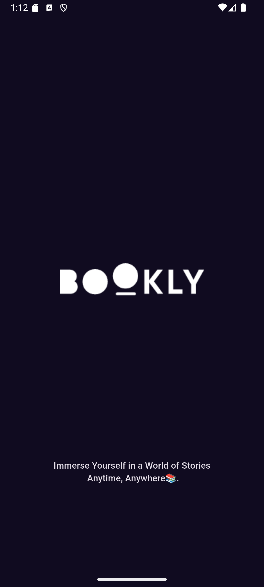
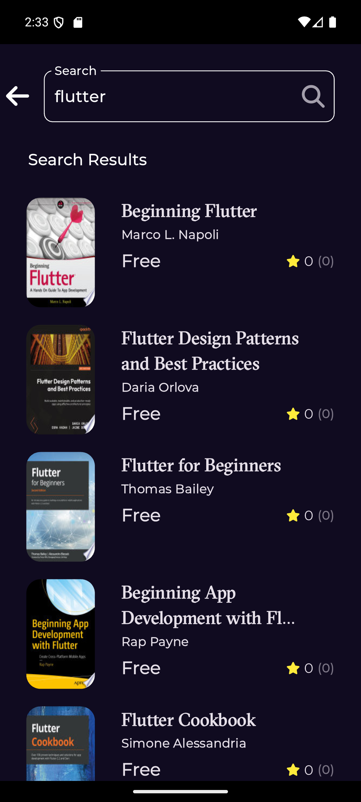

# Bookly 📚

Bookly is a modern and intuitive Flutter application designed for book lovers to discover, explore, and manage their favorite books. Whether you're looking for the latest bestsellers or want to dive into a classic, Bookly makes it easy to find and organize your reading list.

## Features ✨

- **Splash Screen**: A visually appealing splash screen to welcome users
- **Home Screen**: Displays featured books, newest releases, and personalized recommendations
- **Search Functionality**: Quickly find books by title, author, or genre
- **Book Details**: View comprehensive information about a book, including synopsis, author details, ratings, and reviews
- **Preview Book**: Read a preview of the book before diving in
- **Error Handling**: Graceful error handling with user-friendly messages for network issues, empty states, and more
- **Responsive Design**: Works seamlessly on mobile, tablet, and web platforms

## State Management and Architecture 🏗️

This project uses **Cubit** for state management, ensuring a clean and maintainable codebase. The app follows the **MVVM (Model-View-ViewModel)** architecture pattern, which promotes separation of concerns and scalability.

## Screenshots 📸

<table>
  <tr>
    <td>
      <br/>
      <em>Splash Screen</em>
    </td>
    <td>
      <br/>
      <em>Home Screen</em>
    </td>
       <td>
      <br/>
      <em>Details Screen</em>
    </td>
    <td>
      <br/>
      <em>Search Screen</em>
    </td>
      <td>
      <br/>
      <em>Search Screen</em>
    </td>
 
  </tr>
</table>

## Getting Started 🚀

### Prerequisites

- Flutter SDK (version 3.0.0 or higher)
- Dart (version 2.17.0 or higher)
- Android Studio or VS Code with Flutter extensions installed

### Installation

1. Clone the repository:

   ```bash
   git clone https://github.com/yourusername/bookly.git
   cd bookly
   ```

2. Install dependencies:

   ```bash
   flutter pub get
   ```

3. Run the app:

   ```bash
   flutter run
   ```

### Building the App

For Android:

```bash
flutter build apk
```

For iOS:

```bash
flutter build ios
```

## Project Structure 🗂️

lib/

├── core/                            # Core utilities (constants, themes, extensions, etc.)

├── data/                            # Data layer (models, repositories, data sources)

├── features/                        # Feature modules

│   ├── home/                        # Home feature

│   │   ├── presentation/            # UI components

│   │   ├── repositories/            # Data repositories

│   │   └── models/                  # Data models

│   └── search/                      # Search feature

├── presentation/                   # Shared UI components

└── main.dart                       # Application entry point


## Dependencies 📦

Key packages used in this project:

- **flutter_bloc**: State management using Cubit
- **dio**: Network requests and API calls
- **equatable**: Value equality in Dart objects
- **cached_network_image**: Efficient image loading and caching
- **google_fonts**: Custom typography
- **fluttertoast**: Toast message display

For a complete list of dependencies, check the `pubspec.yaml` file.

## API Integration 🌐

Bookly integrates with the Google Books API to fetch book details, search results, and previews. Ensure you have an API key and add it to your environment variables.

## Contributing 🤝

We welcome contributions from the community! To contribute:

1. Fork the repository
2. Create a new branch for your feature or bugfix
3. Commit your changes with clear and descriptive messages
4. Submit a pull request

Please ensure your code adheres to our coding standards and includes relevant tests.

## License 📄

This project is licensed under the MIT License. See the LICENSE file for details.

## Contact 📧

- Email: <omar.moharam.dev@gmail.com>
- Twitter: @Omar28Abdulla1
